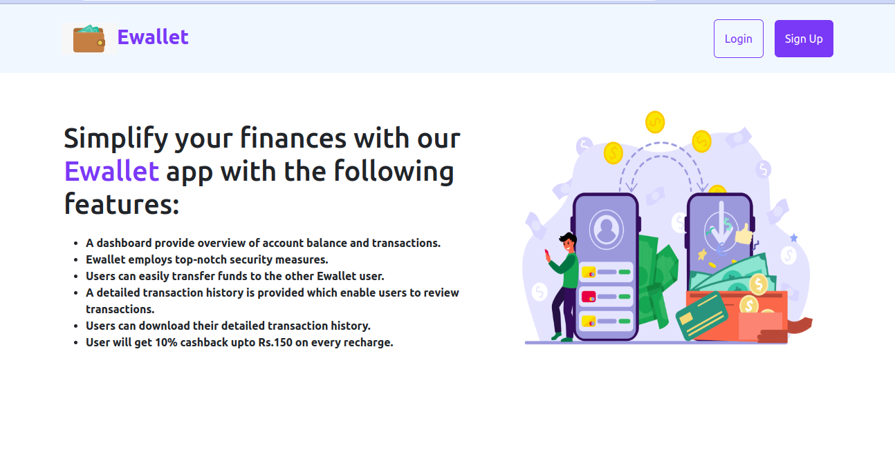
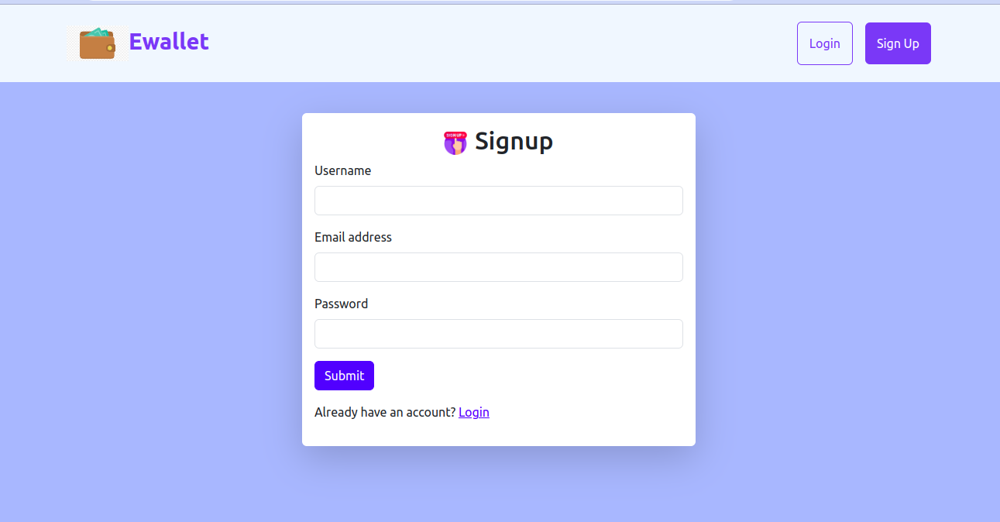
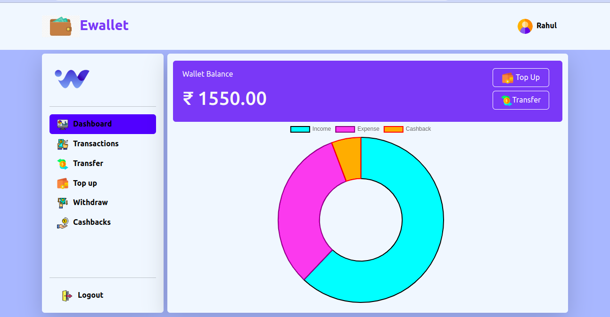
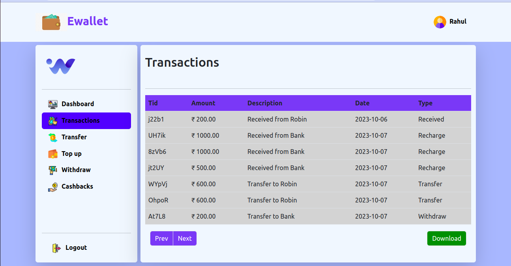

# Wallet Banking Application

### Description

A wallet banking app using java spring boot and react.js

### Main Function/Feature

- JWT authentication
- Email verification using verification token
- Bcryptencoder for password hashing
- User can top up and withdraw the funds on wallet app
- User can transfer the funds to other ewallet user
- User can see and download whole transaction
- Email notification on every transaction
- User can see statistics of transactions on ewallet app through doughnut chart

### Language and Tools

- Java Spring Boot
- React.js
- MongoDB
- Jest
- Junit

### Website Images

#### Landing Page

#### Signup Page

#### Login Page

#### Dashboard Page

#### Transactions Page

